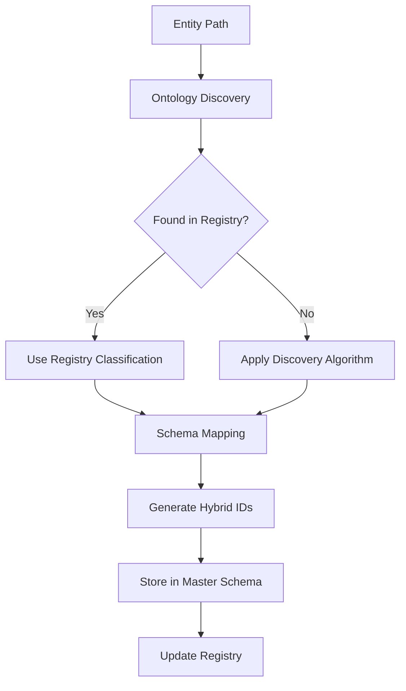

# Schema-Ontology Relationship in ChittyOS

## How Schema and Ontology Work Together

The **schema** and **ontology** serve different but complementary purposes:

### 1. **Ontology = Classification System (Discovery & Rules)**
The ontology (`/Users/nb/chittyos_ontology/`) defines:
- **WHAT** entities exist in the system
- **HOW** to classify them based on discovery rules
- **WHICH** category an entity belongs to

```
ChittyOS Ontology Discovery Algorithm:
┌─────────────────────────────────────────┐
│ 1. Check SERVICE_REGISTRY (highest)    │
│ 2. Match legal patterns (arias*, legal)│
│ 3. Detect .git (version control)       │
│ 4. Default to unstructured_data        │
└─────────────────────────────────────────┘
```

### 2. **Schema = Data Structure (Storage & Format)**
The schema (`master-entity-schema.js`) defines:
- **HOW** to store the classified entities
- **WHAT** fields each entity record contains
- **WHERE** to put the data (database tables, KV stores)

```
Master Entity Schema Structure:
{
  id: 'uuid',
  identifiers: {
    technical: 'AA-C-TSK-1234-I-25-7-X',
    legal: '01-N-USA-1234-P-25-3-X',
    internal: 'uuid-v4'
  },
  metadata: { /* classification from ontology */ },
  content: { /* actual entity data */ }
}
```

## The Complete Flow

```
1. DISCOVERY (Ontology)
   Entity Path → Ontology Rules → Classification

2. CLASSIFICATION (Ontology)
   "This is a 'service' with KV presence"

3. SCHEMA MAPPING (Schema)
   Classification → Master Entity Schema → Database Record

4. ID GENERATION (Schema + Ontology)
   Schema Structure + Ontology Type → Hybrid IDs
```

## Concrete Example

### Input: `/Users/nb/chittyos_ontology/directory_ontology.txt`

**Step 1: Ontology Classification**
```javascript
// Ontology discovers this entity
const classification = {
  type: 'legal_data',
  category: 'compliance',
  source: 'pattern_detection', // matches legal* pattern
  precedence: 2
}
```

**Step 2: Schema Application**
```javascript
// Schema structures the data
const entityRecord = {
  id: 'uuid-generated',
  identifiers: {
    technical: 'AA-C-LEG-1234-I-25-7-X', // LEG namespace from classification
    legal: '01-N-USA-1234-P-25-3-X',     // P type for legal entity
    internal: 'internal-uuid'
  },
  metadata: {
    content_hash: 'sha256-of-file',
    lifecycle_status: 'active',
    steward: {
      technical: 'system',
      legal: 'legal-team'
    },
    compliance: {
      classification: 'confidential', // because it's legal_data
      jurisdictions: ['USA']
    }
  },
  content: {
    type: 'legal_data',
    data: { /* actual ontology file content */ }
  }
}
```

**Step 3: Storage (Schema-Defined)**
```sql
-- PostgreSQL table from schema
INSERT INTO master_entities (
  technical_id, legal_id, entity_type,
  classification, content_data
) VALUES (
  'AA-C-LEG-1234-I-25-7-X',
  '01-N-USA-1234-P-25-3-X',
  'legal_data',
  'confidential',
  '{"ontology_rules": "..."}'
);
```

## Key Relationships

| Component | Purpose | Example |
|-----------|---------|---------|
| **Ontology** | Classify what something IS | "This is legal_data because it matches legal* pattern" |
| **Schema** | Structure HOW to store it | "Legal_data gets LEG namespace and P entity type" |
| **Registry** | Track WHERE it exists | "Entity AA-C-LEG-1234 exists in KV at key entity:legal_data" |

## The Generator Flow



## Answer to Your Question

**The schema does NOT generate from the ontology.** Instead:

1. **Ontology** discovers and classifies entities
2. **Schema** provides the structure to store those classified entities
3. **Controller** uses BOTH to generate properly formatted IDs and records

The ontology tells us "this is a legal document," and the schema tells us "legal documents go in the LEG namespace with P entity type and get stored in the legal_data table with compliance metadata."

They work together as a **classification + storage** system, not a generation relationship.